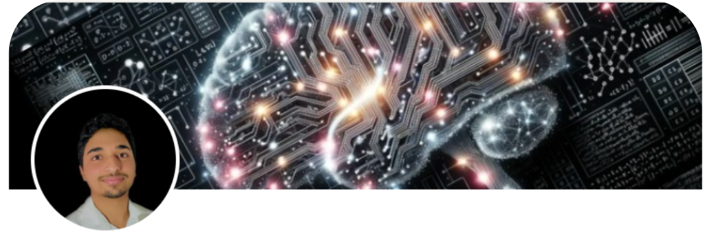

Welcome to my GitHub portfolio! I'm an engineering graduate actively seeking a full-time position as a Data Science, Statistics, and Learning Engineer. I aim to leverage the skills and knowledge I've gained during my years at engineering school and preparatory classes. I'm eager to apply these in a professional setting, learn new technologies, and continue to grow both professionally and personally.

## Table of Contents

- [Education](#education)
- [Experience](#experience)
- [Projects](#projects)
- [Developer Tools](#developer-tools)
- [Contact](#contact)

## Education

### [International Baccalaureate SM - 2019](https://maps.app.goo.gl/bDXLzZkFA9UpBHeM9)
- **Institution**: Lycée Errazi, Settat, Morocco
- Graduated with honors.

### [Preparatory Classes (MP*) - 2019-2021](https://maps.app.goo.gl/Tfgo2rgHRvBjRg8n9)
- **Institution**: CPGE Mohamed V, Casablanca, Morocco
- Intensive 2-year course in mathematics, physics, and engineering sciences.
- Ranked 28th out of 2574 nationally.

### [Engineering Degree (Statistics and Data Science) - 2021-2024](https://maps.app.goo.gl/DxeuFiprKuxduHEKA)
- **Institution**: École Centrale de Nantes
- **Program**:
  - Common core: Generalist Engineer.
  - 2nd year: Advanced Programming, AI, and Robotics.
  - 3rd year: Mathematics and Applications (Statistics and Data Science).
- **Relevant Courses**:
  - Machine learning
  - Statistics (Frequentist and Bayesian)
  - Operations research
  - Time series
  - Statistical learning

## Experience

### [R&D Engineer - Computational and Data Science (2024)](https://maps.app.goo.gl/hwvdcT9Mv331LjHh9)
**End of Study Project**
- **Company**: Air Liquide, Ile de France
- **Description**: 
  - Calibration of a surrogate model of an industrial device
  - Generation of fictitious data
  - Uncertainty quantification and sensitivity study
  - Benchmarking calibration algorithms
  - Tuning the hyperparameters of a neural network
- **Tools**: scikit-learn, TensorFlow, Keras, Openturns, pandas, Gitlab

### [Robotics Software Engineer (2023)](https://maps.app.goo.gl/vvDnHYdNbFcQR77G8)
**Engineering Internship**
- **Company**: Haption, Laval
- **Description**: 
  - Performance estimation of a teleoperation device
  - Implementation of statistical tests to characterize the devices
  - Design of a camera tracking system for the robot
  - Development of a GUI
- **Tools**: C++, Linux, Python, OpenCV, API, Qt, GUI

### [Data Scientist (2022)](https://maps.app.goo.gl/XdjZsCMRto3mM4dDA)
**Observation Internship**
- **Company**: Wafa Gestion, Casablanca
- **Description**: 
  - Portfolio management by OPCVM
  - Risk analysis
  - Identification of risk and performance indicators

### [Citizen Engagement: Tutoring (2021-2022)](https://maps.app.goo.gl/iiE1quZAZ3cfALHL9)
- **Location**: Collège Stendhal, Nantes
- **Description**: 
  - Mentored secondary school students in mathematics and physics

## Projects

### [Stochastic Pricing of an Excess of Loss Treaty at Generali IARD](https://github.com/akoutit)
- **Description**: Simulation in R of several thousand years of claims history using advanced statistical models.
- **Skills**: Kolmogorov-Smirnov test, QQ-plot, Extreme values

### [Real-time Prediction of Crowds in SNCF-Transilien Trains](https://github.com/akoutit/DataChallenge)
- **Description**: Developed a real-time prediction model to anticipate occupancy rates in SNCF-Transilien trains, aiding in better planning for the next station's passenger load.
- **Skills**: Machine Learning, Predictive Modeling, Transportation Analytics
- **Tools**: Pandas, scikit-learn, Keras

### [Constraint-based Optimization](https://github.com/akoutit/ROPAH)
- **Description**: Designed a parallel robot for pick & place operations while adhering to space and singularity constraints.
- **Skills**: Robotics, Constraint Optimization

### [Global Power Rankings Hackathon](https://github.com/akoutit/GlobalPowerRanking)
- **Description**: Developed a method to rank the world's top LoL Esports teams using official Riot Games data and AWS services.
- **Skills**: Data Analysis, AWS

### [Snake Game Bots Development](https://github.com/akoutit/Snake)
- **Description**: Designed and developed autonomous bots to play a Snake game at various difficulty levels.
- **Skills**: Advanced programming, Game Development
- **Tools**: C++, Pygame, Qt

### [Queue Modeling Comparison](https://github.com/akoutit/Files_Attente)
- **Description**: Modeled queues and estimated wait times.
- **Skills**: Probability, Stochastic Processes

## Developer Tools

- **Python**:
  - scikit-learn
  - Openturns
  - smt
  - scipy
  - pandas
- **R**:
  - Tidyverse
  - ggplot2
- **MySQL**
- **C++**
- **ROS2**
- **Matlab, Simulink**
- **Linux**
- **GitLab**
- **LaTeX**

## Contact

- **Email**: [AbdellahKoutit@gmail.com](mailto:abdellahkoutit@gmail.com)
- **Phone**: [+33-622853368](tel:+33-622853368)
- **Location**: [Versailles, France](https://maps.app.goo.gl/HQfSmMbQ2qkAHR2c8)
- **Portfolio**: [akoutit.github.io](https://akoutit.github.io)
- **LinkedIn**: [Abdellah Koutit](https://www.linkedin.com/in/abdellah-koutit-5ab9851a4/)
